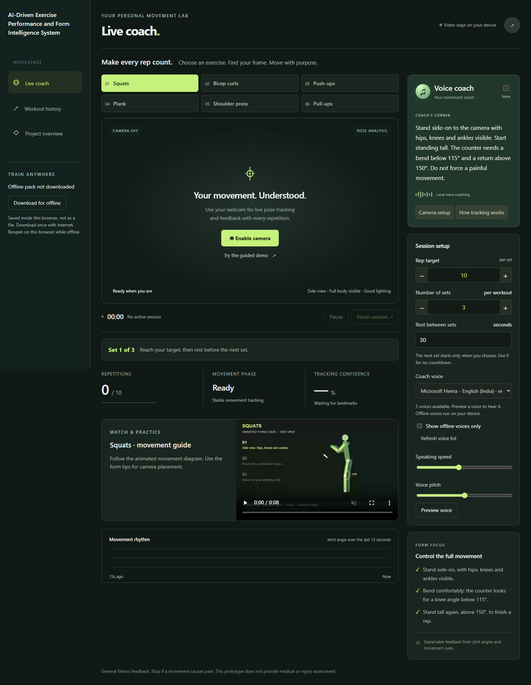
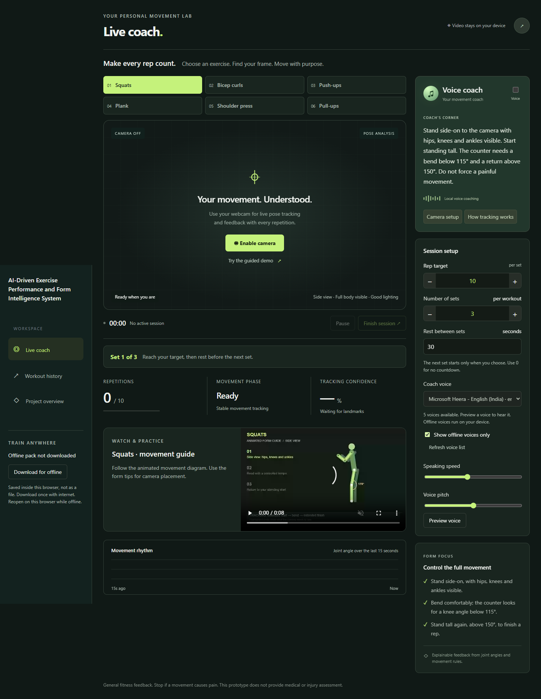
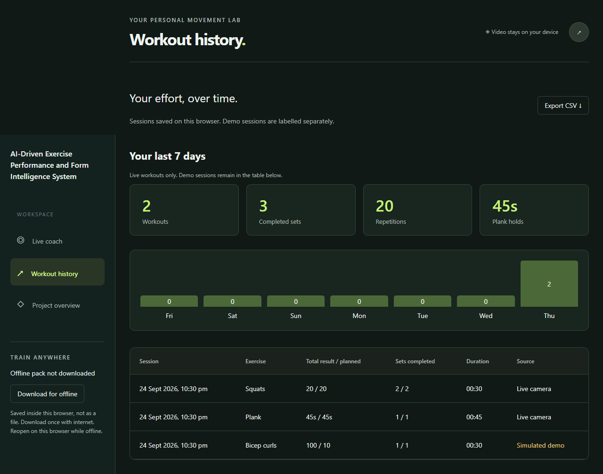

# AI-Driven Exercise Performance and Form Intelligence System

> A browser-based computer-vision fitness assistant for real-time exercise tracking, rep counting, form feedback, guided sets, and local progress monitoring.


## Overview

This project turns a webcam-enabled browser into an exercise assistant. It uses Google's pretrained **MediaPipe Pose Landmarker** to detect body landmarks locally and an exercise-specific rule engine to interpret joint geometry, movement phases and valid holds.

The system supports **squats, bicep curls, push-ups, shoulder presses, pull-ups and planks**. Along with rep/hold tracking, it provides camera-readiness checks, configurable set targets, rest timers, spoken cues, local workout history, CSV export and offline operation.

The project is designed as a working demonstration of explainable exercise tracking: measurements such as joint angles and movement states are used directly by the rule engine rather than presenting a black-box form score.

## Application Preview

### Desktop workout interface


### Exercise coaching


### Progress tracking


## Key Features

- **Real-time pose tracking** using MediaPipe Pose Landmarker.
- **Six exercise modes:** squat, bicep curl, push-up, shoulder press, pull-up and plank.
- **Rep and hold detection** based on exercise-specific movement rules.
- **Camera readiness gating** before counting begins or resumes.
- **Visible joint/angle feedback** to make tracking behavior easier to understand.
- **Set targets** from 1–20 sets with reps or hold seconds per set.
- **Rest timer** configurable from 0–300 seconds.
- **Voice coaching** using voices available through the browser/operating system.
- **Workout history and CSV export** stored locally.
- **Seven-day activity summary** for real workout sessions.
- **Responsive interface** for desktop and mobile.
- **Offline pack/PWA support** with bundled model, runtime and exercise guides.
- **Simulation/demo flows** for presentation and testing without counting them as real sessions.

## Supported Exercises

| Exercise | Primary tracking idea | Recommended view |
| --- | --- | --- |
| Squat | Lower-body joint movement and rep cycle | Side |
| Bicep Curl | Elbow flexion/extension cycle | Side |
| Push-up | Upper-body movement cycle | Side |
| Shoulder Press | Arm movement with wrists above shoulders | Front |
| Pull-up | Elbow movement cycle | Front |
| Plank | Valid body alignment accumulated over time | Side |

> Pull-up tracking measures elbow cycles and does not verify chin clearance over a physical bar.

## How It Works

```text
Webcam
   |
   v
MediaPipe Pose Landmarker
   |
   v
Body Landmark Coordinates
   |
   v
Joint / Geometry Measurements
   |
   v
Exercise-Specific Rule Engine
   |
   +----> Rep / Hold Detection
   |
   +----> Form & Tracking Feedback
   |
   +----> Set / Rest Management
   |
   v
Workout History + Progress + Voice Cues
```

The application processes pose landmarks in the browser. Exercise rules then evaluate the relevant joints and movement states. A stable starting position and visible required landmarks are checked before counting begins.

## Technology Stack

| Area | Technology |
| --- | --- |
| Front end | HTML, CSS, JavaScript |
| Computer vision | MediaPipe Pose Landmarker |
| Pose model | Bundled pretrained MediaPipe pose model |
| Local server | Node.js |
| Offline support | Service Worker + Web App Manifest |
| Voice feedback | Web Speech / installed browser voices |
| Data storage | Browser-local storage |
| Testing | Node.js tests + browser QA scripts |
| Deployment | Netlify |

No API key is required and there is no model-training step.

## Quick Start

### Requirements

- Node.js 20 or newer
- A modern browser
- Webcam access for live tracking

### Run locally

Clone the repository:

```bash
git clone https://github.com/Sgaurav1708/AI-Driven-Exercise-Performance-and-Form-Intelligence-System.git
cd AI-Driven-Exercise-Performance-and-Form-Intelligence-System
```

Start the application:

```bash
npm start
```

On Windows, you can alternatively run:

```text
Start Exercise Intelligence.cmd
```

Then open:

```text
http://127.0.0.1:4173
```

Keep the local server running while using the application. Do not open `dist/index.html` directly because camera and offline features require a server context.

## Exercise Session Flow

1. Select an exercise.
2. Configure sets and rep/hold targets.
3. Start the camera.
4. Move into the recommended camera view.
5. Wait for the readiness check to confirm visible joints and a stable starting position.
6. Perform the movement while the rule engine tracks reps or valid hold time.
7. Complete the target and use the configured rest period before the next set.
8. Save the session and review local progress/history.

## Offline Use

Open the application while online and select **Download for offline**. Wait until the interface reports **Offline pack ready** before disconnecting.

The offline package is stored in browser storage and includes the required runtime assets, pose model and exercise-guide media. Reopen the same application address in the same browser when offline.

Important limitations:

- The first offline download requires internet access.
- Clearing browser storage can remove cached assets.
- Private browsing may not preserve the cache.
- Offline availability is specific to the browser/device.
- For spoken coaching while offline, select a voice available locally on the device.

The local Node.js server can also operate without internet because the required runtime assets are bundled.

## Deployment

The deployable application is contained in `dist/`.

For Netlify manual deployment, upload the complete `dist` folder. For repository-based deployment, use:

```text
Publish directory: dist
Build command: none
```

A `netlify.toml` configuration is included.

For presentations or testing on another device, use the deployed HTTPS address rather than the local `127.0.0.1` address.

## Testing & Verification

Run the automated tracking tests with:

```bash
npm test
```

The tests cover areas including:

- geometry calculations
- rep-cycle logic
- tracking loss
- frame-rate behavior
- plank timing

Browser QA additionally covers the six demonstration flows, pause/save/reload behavior, mobile layout, offline video playback and offline model initialization.

See [VERIFICATION.md](VERIFICATION.md) for the verification scope.

## Project Structure

```text
.
├── dist/
│   ├── index.html
│   ├── app.js
│   ├── engine.js
│   ├── training.js
│   ├── guides.js
│   ├── styles.css
│   ├── guides/
│   └── sw.js
├── tests/
├── qa/
├── scripts/
│   └── generate-guides.mjs
├── server.mjs
├── netlify.toml
├── VERIFICATION.md
├── THIRD-PARTY-NOTICES.md
└── README.md
```

### Important modules

- **`dist/engine.js`** — geometry, measurements and exercise tracking rules.
- **`dist/training.js`** — readiness gating, rest timing and weekly progress aggregation.
- **`dist/app.js`** — sessions, webcam analysis, feedback and voice configuration.
- **`dist/guides.js`** — movement-diagram geometry used by simulations and guide generation.
- **`dist/sw.js`** — offline caching and video range handling.
- **`server.mjs`** — local static server.

## Tracking Scope & Limitations

This project uses Google's pretrained MediaPipe Pose Landmarker. It **does not train a custom neural network** and does not automatically recognize which exercise the user is performing.

Landmark confidence represents landmark visibility/tracking confidence; it should not be interpreted as a clinically validated form-accuracy score.

Performance can be affected by:

- camera position and field of view
- lighting
- occlusion
- loose or visually ambiguous clothing
- body orientation
- device/browser performance

The system is a fitness technology prototype and is **not a medical, rehabilitation or injury-diagnosis system**. Real-person evaluation across different body types, environments and cameras remains an important area for further testing.

## Future Improvements

Potential extensions include multi-person rejection/selection, broader real-person evaluation, additional exercises, personalized range-of-motion calibration, richer long-term analytics, optional cloud synchronization and more advanced temporal movement analysis.

## Third-Party Components

MediaPipe runtime and pose-model notices are retained in [THIRD-PARTY-NOTICES.md](THIRD-PARTY-NOTICES.md) and `dist/vendor/LICENSE.txt`.

The referenced `ai-gym-coach` project provided concept inspiration; its source code and visual assets were not copied into this application.

## Author

**Gaurav Kumar**

B.Tech — Computer Science & Engineering (Cyber Security)

GitHub: [@Sgaurav1708](https://github.com/Sgaurav1708)

---

If this project is useful for learning about browser-based pose tracking and exercise intelligence, consider starring the repository.
